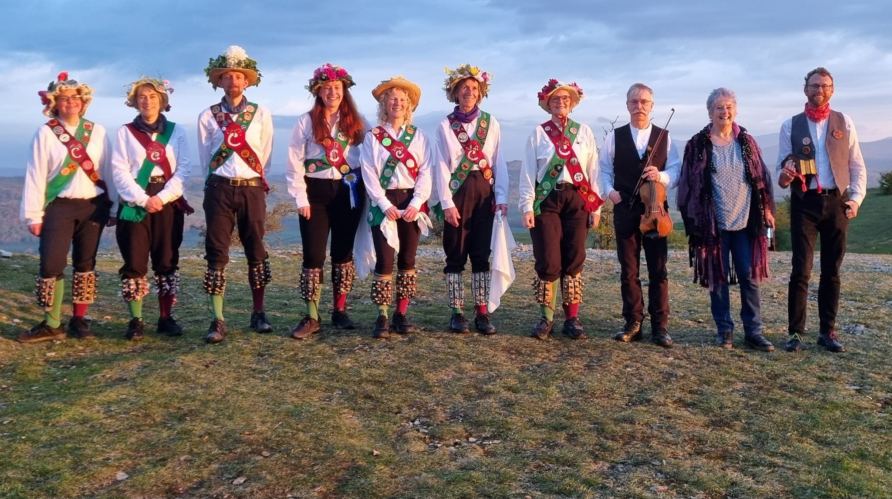
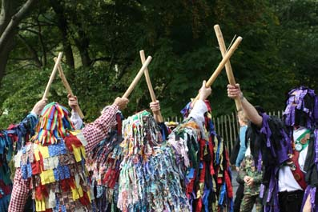
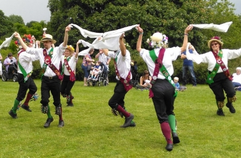

Crook Morris is a mixed Morris side based in Kendal, Cumbria. We perform a variety of dances from traditions all over England.

[More about us](about-us)

You can also find us on social media:


## Where to see us this season


```
Event help for editors
   
   First line:
   
       - for a one day event
   
       - for a one day event with note (e.g. "tbc")
   
       - for a multi day event
         or if for some other reason you need to show a different date 
         (in this case yyyy-mm-dd should be the last day of the event
         so it can be hidden automatically when the event us over)
   
       - for a multi day event with note

   Next lines: any markdown like the rest of the page.
   This is usually a link to the venue and a short description.
   You can also use images, with
   
   this should be on its own line.
   Upload images somewhere in the assets/ folder.
   
   Last line:
   

   ## That's it!
```



[Shap Farmers' Market](https://www.theoldcourthouse.org/events/market/), The Old Courthouse, Shap


 
 **Crook Christmas Ceilidh**, Kendal Parish Hall, Doors 7:15pm for 7:30pm


 
 [The Smithy Inn with Kendal Revellers](https://www.smithyinn.co.uk/), Holme,  LA6 1PS

 
Over the winter we'll be busy practicing and learning new dances to bring you in 2026.

## Where to see us in 2026

New events will be added to this list as we organise them!


**Wassail** at The Row, Lyth Valley, and the Black Labrador, Underbarrow



[Upton Folk Festival](https://uptonfolk.org/), Upton-upon-Severn



## Book us for your event

We are happy to come and dance at local pubs, events and festivals during the summer season (roughly April until September.) We're lucky to have a fair number of dancers and musicians but it's always best to get us booked in early!

[Contact our squire](mailto:crook.morris.squire@gmail.com) to make an enquiry.




## Get involved

We are a friendly and inclusive side and welcome all new faces!

We practice on Monday nights from October until March, then during the summer we perform at local pubs, events and festivals.

 -- this is hidden, reinstate/update it in the summer

If you'd like to try out morris or rapper dancing, look out for our taster day! This year we'll be gathering in the
[Abbot Hall Social Centre](https://www.openstreetmap.org/#map=18/54.323425/-2.746244), Dowkers Lane, Kendal LA9 4DN on **Sunday 28th September**. All are welcome to come and have a go with no commitment.



[Send us a message](mailto:crook.morris.squire@gmail.com) to find out more.


