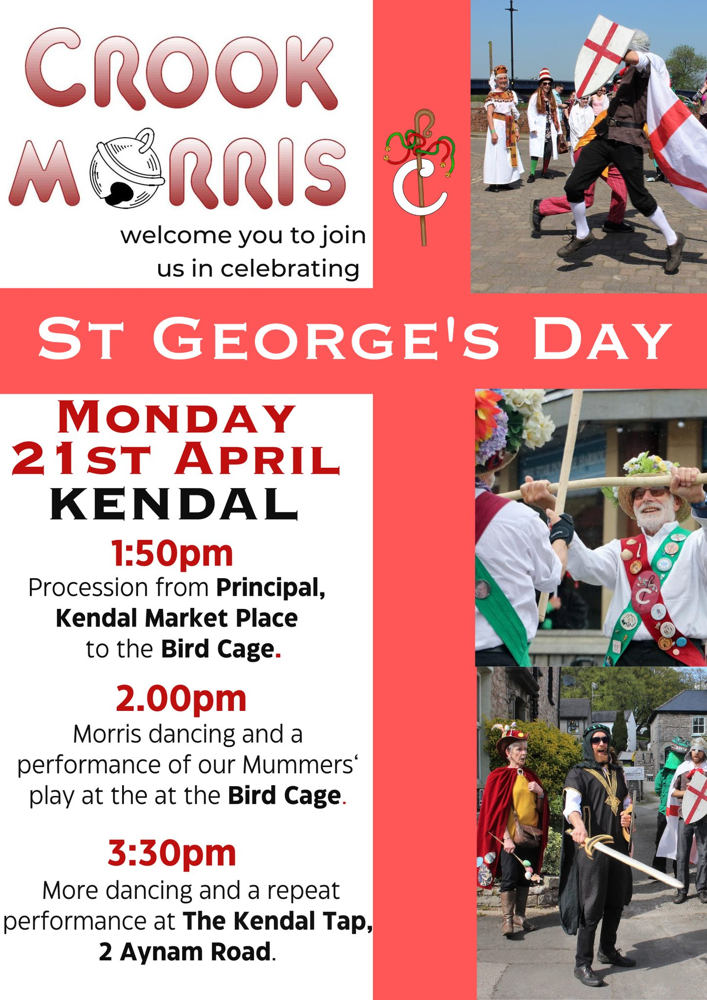

Crook Morris is a mixed Morris side based in Kendal, Cumbria.
We formed in 1981 from members of Crook Folk Dance Group.

We perform dances from many different traditions all over England, including our own. Our total repertoire numbers around 50 dances, of which we choose about 30 each year to practice and perform.

[More information and videos](dances)



## Where to see us


St George's day, The Birdcage, Kendal

With mumming!




[Upton Folk Festival](https://www.uptonfolk.org/), Upton-upon-Severn, Worcestershire



Somewhere in Levens at 7.45pm



[The Greyhound, Halton](https://thegreyhoundhalton.co.uk/) near Lancaster


## Book us for your event

We are happy to come and dance at local pubs, events and festivals during the summer season (roughly April until September), subject to people's availability. We're lucky to have a fair number of dancers and musicians but it's always best to get us booked in early!

[Contact our squire](mailto:squire@crookmorris.org.uk) to make an enquiry.

## Get involved

We are a friendly and inclusive side and welcome all new faces!

We practice on Monday nights from October until March, then during the summer we perform at local pubs, events and festivals.

If you'd like to try out morris or rapper dancing, look out for our taster day, held in Kendal in September before the practice season begins. All are welcome to come and have a go with no commitment.

[Send us a message](mailto:squire@crookmorris.org.uk) to know more.

## Practical information

Our [members' area](members) is full of information for Crook members.

